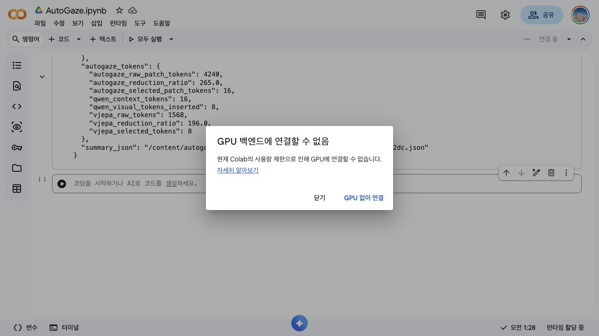
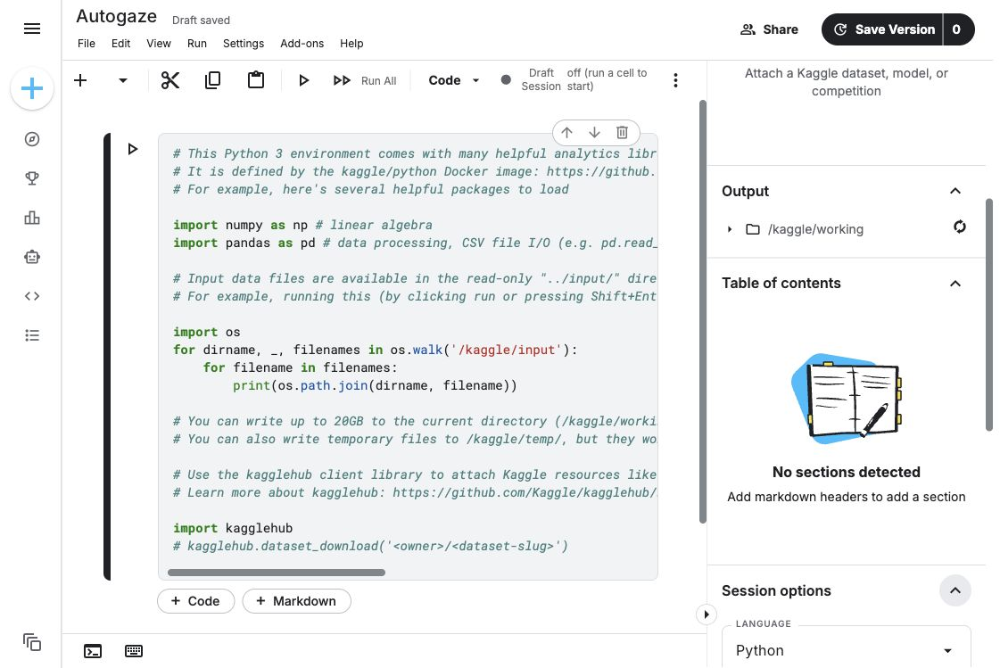

# 외부 CUDA 플랫폼 검증 리포트

작성일: 2026-05-28  
대상 브랜치: `codex/autogaze-repro`, `codex/autogaze-vjepa`  
검증 커밋: `d972d2e Document external CUDA verification blockers`

## 결론

Colab, Kaggle, Hugging Face Jobs를 CUDA 검증 플랫폼 후보로 직접 확인했습니다. Chrome extension 재설치 이후 Kaggle notebook에서 GPU T4 x2와 Internet on을 활성화했고, `codex/autogaze-vjepa` 브랜치의 CUDA smoke를 실제로 끝까지 실행했습니다.

Kaggle actual smoke 결과는 `passed=true`, `failed_count=0`입니다. Colab은 GPU 사용량 제한, Hugging Face Jobs는 prepaid credit 부족으로 아직 막혀 있지만, 동일한 notebook/cell을 CUDA 머신이나 Colab quota 회복 런타임에서도 재사용할 수 있습니다.

## 외부 플랫폼 접근 상태

| 플랫폼 | 접근 | CUDA 실행 상태 | 상태 |
| --- | --- | --- | --- |
| Colab | 가능 | 실패 | Colab 사용량 제한으로 GPU 백엔드 연결 불가 |
| Kaggle `manricheon/autogaze` | 가능 | 성공 | GPU T4 x2, Internet on, actual CUDA smoke 통과 |
| Hugging Face Jobs | API 접근 가능 | 실패 | 계정 pre-paid credit 부족으로 GPU job 생성 402 |

Colab 증거 스크린샷:



Kaggle 증거 스크린샷:



위 스크린샷은 최초 재시도 전 상태입니다. Chrome extension 재설치 후 같은 Kaggle notebook에서 GPU T4 x2 선택지가 활성화되었고, 실제 CUDA smoke를 완료했습니다.

## Kaggle actual CUDA 검증 결과

실행 위치:

```text
https://www.kaggle.com/code/manricheon/autogaze/edit
```

런타임:

```text
python: 3.12.13
torch: 2.10.0+cu128
cuda_available: True
cuda_device: Tesla T4
cuda_device_count: 2
```

검증 브랜치/커밋:

```text
codex/autogaze-vjepa
d972d2e Document external CUDA verification blockers
```

Entrypoint verifier:

```json
{
  "check_count": 26,
  "command_count": 19,
  "failed_check_count": 0,
  "failed_command_count": 0,
  "passed": true
}
```

CUDA smoke wrapper:

```json
{
  "command_count": 5,
  "elapsed_ms": 298198.6757550003,
  "failed_count": 0,
  "passed": true
}
```

실행된 actual cases:

| case | status | answer | total ms | selected / raw tokens | Qwen visual tokens | peak memory |
| --- | --- | --- | ---: | ---: | ---: | ---: |
| `vjepa_qwen_dense_off` | `passed` | `Describe the video in one short sentence. The video is about` | 27263.93 | 1568 / 1568 | 1568 | 7.509 GiB |
| `autogaze_vjepa_qwen_on` | `passed` | `Describe the video in one short sentence.` | 24588.99 | 8 / 1568 V-JEPA, 16 / 4240 AutoGaze patches | 8 | 7.117 GiB |

핵심 관찰:

- AutoGaze on case에서 V-JEPA 입력 token은 `1568 -> 8`로 감소했습니다.
- Qwen에 삽입된 visual token도 `1568 -> 8`로 감소했습니다.
- Qwen generate latency는 `1440.71 ms -> 178.82 ms`로 줄었습니다.
- V-JEPA sparse encode latency는 `1263.16 ms -> 155.82 ms`로 줄었습니다.
- AutoGaze selector 자체는 `9629.44 ms`가 추가되었습니다. 따라서 이 smoke에서는 “후단 token/latency 이득은 확인되지만 selector cost까지 포함한 end-to-end 최적화는 추가 개선 대상”입니다.
- 전체 peak CUDA memory는 `8062205440 -> 7641718784 bytes`로 감소했습니다.

Kaggle에서 생성된 주요 artifact:

```text
/kaggle/working/autogaze_vjepa_outputs/colab_verification.md
/kaggle/working/autogaze_vjepa_outputs/colab_autogaze_cuda_smoke_summary.json
/kaggle/working/autogaze_vjepa_outputs/visualizations/vjepa_qwen_off_selected_frames.png
/kaggle/working/autogaze_vjepa_outputs/visualizations/vjepa_qwen_off_vjepa_token_mask.png
/kaggle/working/autogaze_vjepa_outputs/visualizations/vjepa_qwen_on_selected_frames.png
/kaggle/working/autogaze_vjepa_outputs/visualizations/vjepa_qwen_on_vjepa_token_mask.png
/kaggle/working/autogaze_vjepa_outputs/visualizations/vjepa_qwen_on_autogaze_overlay.png
```

Kaggle notebook 출력에서 selected frames, dense/off V-JEPA token mask, AutoGaze/on V-JEPA token mask, AutoGaze overlay 이미지를 확인했습니다.

## Kaggle NVILA-HD CUDA 검증 결과

Chrome extension 재설치 후 같은 Kaggle notebook에서 `repro.nvila_runner`와 HLVid wrapper도 CUDA smoke로 확인했습니다.

실행 조건:

```text
model: nvidia/NVILA-8B-HD-Video
AutoGaze checkpoint: /kaggle/working/autogaze_weights/nvidia__AutoGaze
device: cuda, device_map: auto, dtype: float16
GPU: Tesla T4 x2
video: inputs/hlvid_example/clip_av_video_5_001.mp4
frames: 16
thumbnail frames: 16 for AutoGaze smoke, 1 for keep-all-single smoke
max_tiles_video: 1
video_resize_longest_edge: 224
video_decode_strategy: seek
max_new_tokens: 1
```

### 확인한 호환성 이슈와 수정

Kaggle의 최신 `torch 2.10.0+cu128` / 최신 Transformers 조합에서 NVILA remote code가 아래 호환성 문제를 순서대로 드러냈습니다.

| 단계 | 증상 | 수정 |
| --- | --- | --- |
| AutoGaze processor load | `AutoGaze`에 `all_tied_weights_keys`가 없음 | `ensure_transformers_all_tied_weights_keys_compat()` 추가 |
| Llama model init | read-only property 때문에 `property ... has no setter` | setter 있는 compatibility property로 수정 |
| NVILA SigLIP remote import | `_trunc_normal_`, `trunc_normal_tf_` 등 private helper import 실패 | `ensure_siglip_private_init_compat()` 추가 |
| AutoGaze gaze decoder generate | `inputs_embeds` generate에서 0-length reshape RuntimeError | `patch_processor_autogaze_inputs_embeds_generate_compat()` 추가 |
| HLVid wrapper | `--dtype float16` unsupported | `repro.hlvid_batch_benchmark` parser/runner command에 `--dtype` forwarding 추가 |

이 수정 뒤 NVILA-HD single smoke와 HLVid mini benchmark가 Kaggle CUDA에서 실행됐습니다.

### NVILA-HD single smoke

| mode | answer | total ms | preprocess(no AG) ms | AutoGaze ms | vision encoder ms | generate ms | LLM forward ms | encoder selected/raw tokens | LLM visual tokens | peak memory |
| --- | --- | ---: | ---: | ---: | ---: | ---: | ---: | ---: | ---: | ---: |
| single-scale dense | `The` | 17934.13 | 11673.03 | 9.83 | 4215.24 | 6251.27 | 1738.17 | 13328 / 13328 | 1496 | 12.44 GiB |
| AutoGaze | `The` | 10828.00 | 5083.49 | 1591.90 | 1831.84 | 4152.61 | 2075.46 | 17024 / 33920 | 1904 | 7.85 GiB |

해석:

- Kaggle T4 x2 smoke에서는 AutoGaze 적용 후 peak memory가 `12.44 GiB -> 7.85 GiB` 수준으로 줄었습니다.
- Vision encoder latency도 `4215 ms -> 1832 ms`로 줄었습니다.
- AutoGaze selector cost는 약 `1592 ms`였습니다.
- 이 smoke는 `max_tiles_video=1`, `resize_longest_edge=224`라 논문 셋업 성능 주장이 아니라 “CUDA 실행/계측 경로 검증”입니다.

### NVILA-HD HLVid mini benchmark

`scripts/run_hlvid_folder_benchmark.py`를 통해 mini HLVid manifest 1개 샘플을 실행했습니다.

생성 artifact:

```text
/kaggle/working/autogaze_vjepa_outputs/nvila_hlvid_mini_dtype_generate_fix/hlvid_autogaze_gain_report.json
/kaggle/working/autogaze_vjepa_outputs/nvila_hlvid_mini_dtype_generate_fix/hlvid_autogaze_gain_report.csv
/kaggle/working/autogaze_vjepa_outputs/nvila_hlvid_mini_dtype_generate_fix/hlvid_single_scale_dense_predictions.jsonl
/kaggle/working/autogaze_vjepa_outputs/nvila_hlvid_mini_dtype_generate_fix/hlvid_single_scale_dense_summary.json
/kaggle/working/autogaze_vjepa_outputs/nvila_hlvid_mini_dtype_generate_fix/hlvid_autogaze_predictions.jsonl
/kaggle/working/autogaze_vjepa_outputs/nvila_hlvid_mini_dtype_generate_fix/hlvid_autogaze_summary.json
```

요약:

| mode | failed | parse_failed | accuracy_total | generated answer | total ms | AutoGaze ms | vision encoder ms | generate ms | LLM forward ms |
| --- | ---: | ---: | ---: | --- | ---: | ---: | ---: | ---: | ---: |
| single-scale dense | 0 | 0 | 0.0 | `A` | 14348.84 | 0.84 | 4825.15 | 9146.74 | 3861.17 |
| AutoGaze | 0 | 0 | 0.0 | `A` | 10914.60 | 1256.77 | 1762.68 | 4149.63 | 2137.80 |

Mini benchmark에서 정답은 `B`였고 두 모드 모두 `A`를 출력했기 때문에 accuracy는 `0.0`입니다. 이 결과는 정확도 검증용 샘플이 아니라 wrapper가 prediction/summary/gain report를 생성하고 실패 없이 계속 실행되는지 확인한 smoke입니다.

AutoGaze mini benchmark의 주요 reduction:

```text
siglip total MACs reduction ratio: 4.06x
siglip attention MACs reduction ratio: 17.00x
mllm prefill attention pair reduction ratio: 3.78x
mllm KV cache reduction ratio: 1.94x
```

Hugging Face Jobs GPU smoke 요청 결과:

```text
Error executing run: API request failed: 402 Payment Required
Server response:
{
  "error": "Pre-paid credit balance is insufficient - add more credits to your account to use Jobs."
}
```

## Colab에서 확인한 기존 실패

열려 있던 Colab 출력에는 `repro.vjepa_qwen_colab_smoke` 실행 결과가 남아 있었고, 상태는 `failed`였습니다.

핵심 에러:

```text
RuntimeError: Given groups=1, weight of size [1024, 3, 2, 16, 16],
expected input[1, 4, 3, 224, 224] to have 3 channels, but got 4 channels instead
```

해석:

- V-JEPA Conv3D patch embedding은 일부 런타임/remote-code 경로에서 `[B, C, T, H, W]` 입력을 직접 기대합니다.
- 기존 smoke path는 `[B, T, C, H, W]`를 그대로 넘길 수 있어 Colab에서 `C=4`로 오해되었습니다.
- 반면 일반 Transformers V-JEPA wrapper는 `[B, T, C, H, W]`를 받고 내부에서 `[B, C, T, H, W]`로 바꾸는 경로가 있습니다.
- 따라서 두 형태를 모두 지원하도록 embedding module 타입에 따라 축 순서를 정규화해야 합니다.

## 반영한 수정

수정 커밋: `cfea645`

| 파일 | 변경 |
| --- | --- |
| `repro/vjepa_qwen_colab_smoke.py` | V-JEPA embedding module이 wrapper인지 direct patch embedder인지 감지해 입력 축 순서를 자동 정규화 |
| `repro/vjepa_qwen_runner.py` | 실제 비디오 runner에서도 같은 축 정규화 경로 사용 |
| `tests/test_vjepa_qwen_colab_smoke.py` | direct patch embedding layout과 wrapper embedding layout을 모두 테스트 |
| `tests/test_vjepa_qwen_runner.py` | runner patch embedding boundary가 두 입력 경로를 모두 처리하는지 테스트 |

브랜치 반영:

| 브랜치 | 상태 |
| --- | --- |
| `codex/autogaze-repro` | push 완료 |
| `codex/autogaze-vjepa` | push 완료 |

## 로컬 검증 결과

CUDA 모델 로드는 로컬 MPS/CPU 환경에서 검증 대상이 아니므로 제외했습니다. 대신 Colab 실패 원인에 해당하는 V-JEPA 입력 경계와 전체 entrypoint route는 검증했습니다.

| 검증 | 결과 |
| --- | --- |
| `pytest tests/test_vjepa_qwen_colab_smoke.py tests/test_vjepa_qwen_runner.py -q` | `16 passed` |
| `pytest tests/test_vjepa_sparse_runtime.py tests/test_vjepa_poc.py tests/test_vjepa_qwen_bridge.py -q` | `11 passed` |
| `scripts/verify_autogaze_entrypoints.py --run-pytest` | `passed=true`, `check_count=26`, `command_count=20` |
| full pytest | `406 passed` |
| `git diff --check` | 통과 |
| 공식/upstream 문서 diff | 없음 |

## CUDA 재검증 명령

GPU 백엔드가 연결되는 Kaggle/Colab 또는 CUDA 머신에서 아래 순서로 다시 실행합니다.

### 0. Notebook artifact

Kaggle/Colab에서 셀 단위로 실행하려면 repo에 포함된 노트북을 사용할 수 있습니다.

```text
notebooks/autogaze_external_cuda_verification.ipynb
```

이 파일은 아래 단계를 하나의 notebook으로 묶은 artifact입니다. 다시 생성하려면:

```bash
python scripts/write_external_cuda_verification_notebook.py \
  --output notebooks/autogaze_external_cuda_verification.ipynb \
  --platform kaggle \
  --branch codex/autogaze-vjepa
```

### 1. 최신 코드 받기

```bash
cd /kaggle/working  # Kaggle
# cd /content       # Colab
test -d AutoGaze || git clone --branch codex/autogaze-vjepa https://github.com/manricheon/AutoGaze.git AutoGaze
cd AutoGaze
git fetch origin codex/autogaze-vjepa codex/autogaze-repro
git checkout codex/autogaze-vjepa
git pull --ff-only origin codex/autogaze-vjepa
git log --oneline -1
```

기대 커밋:

```text
d972d2e Document external CUDA verification blockers
```

### 2. 사전 검증

```bash
python scripts/verify_autogaze_entrypoints.py \
  --output-json /kaggle/working/autogaze_vjepa_outputs/entrypoint_verification.json \
  --output-md /kaggle/working/autogaze_vjepa_outputs/entrypoint_verification.md
```

기대:

```text
passed=true
failed_command_count=0
failed_check_count=0
```

### 3. Colab CUDA smoke wrapper

```bash
python scripts/run_colab_autogaze_cuda_smoke.py \
  --weights-root /kaggle/working/autogaze_weights \
  --output-root /kaggle/working/autogaze_vjepa_outputs \
  --video inputs/hlvid_example/clip_av_video_5_001.mp4 \
  --num-video-frames 16 \
  --frames-per-clip 16 \
  --video-resize-longest-edge 224 \
  --max-new-tokens 4
```

기대:

- `results.vjepa_qwen_dense_off.status=passed`
- `results.autogaze_vjepa_qwen_on.status=passed`
- `tokens.vjepa_selected_tokens < tokens.vjepa_raw_tokens`
- `tokens.qwen_visual_tokens_inserted == tokens.vjepa_selected_tokens`
- `/kaggle/working/autogaze_vjepa_outputs/colab_verification.md` 생성
- `/kaggle/working/autogaze_vjepa_outputs/visualizations/` 아래 selected frame, V-JEPA mask, AutoGaze overlay 생성

### 4. 직접 실행 결과를 묶어 리포트 생성

wrapper 대신 기존 runner를 직접 실행했다면 마지막에 아래 명령으로 `colab_verification.md`를 생성합니다.

```bash
python -m repro.colab_verification_report \
  --output-md /kaggle/working/autogaze_vjepa_outputs/colab_verification.md \
  --title "AutoGaze Kaggle/Colab Verification" \
  --video inputs/hlvid_example/clip_av_video_5_001.mp4 \
  --query "Describe the video in one short sentence." \
  --entrypoint-verification-json /kaggle/working/autogaze_vjepa_outputs/entrypoint_verification.json \
  --case vjepa_qwen_dense_off=/kaggle/working/autogaze_vjepa_outputs/vjepa_qwen_dense_off_cuda_smoke.json \
  --case autogaze_vjepa_qwen_on=/kaggle/working/autogaze_vjepa_outputs/autogaze_vjepa_qwen_on_cuda_smoke.json
```

### 5. Kaggle notebook cell

Kaggle notebook에는 아래 셀 하나를 넣고 Run All을 누르면 됩니다. 단, 우측 `Session options`에서 phone verification 이후 GPU와 Internet이 활성화되어 있어야 합니다.

```python
import os, pathlib, subprocess, sys, json

def run(cmd):
    print("\n$", " ".join(map(str, cmd)))
    subprocess.check_call(list(map(str, cmd)))

root = pathlib.Path("/kaggle/working")
repo = root / "AutoGaze"
out = root / "autogaze_vjepa_outputs"
weights = root / "autogaze_weights"
out.mkdir(parents=True, exist_ok=True)

if not repo.exists():
    run(["git", "clone", "--branch", "codex/autogaze-vjepa", "https://github.com/manricheon/AutoGaze.git", repo])
os.chdir(repo)
run(["git", "fetch", "origin", "codex/autogaze-vjepa"])
run(["git", "checkout", "codex/autogaze-vjepa"])
run(["git", "pull", "--ff-only", "origin", "codex/autogaze-vjepa"])
run([sys.executable, "-m", "pip", "install", "-q", "-r", "requirements-repro.txt", "transformers>=4.57.0", "qwen-vl-utils", "av", "pytest"])
run([sys.executable, "scripts/verify_autogaze_entrypoints.py", "--output-json", out / "entrypoint_verification.json", "--output-md", out / "entrypoint_verification.md"])
run([
    sys.executable, "scripts/run_colab_autogaze_cuda_smoke.py",
    "--weights-root", weights,
    "--output-root", out,
    "--video", "inputs/hlvid_example/clip_av_video_5_001.mp4",
    "--num-video-frames", "16",
    "--frames-per-clip", "16",
    "--video-resize-longest-edge", "224",
    "--max-new-tokens", "4",
])

summary = json.loads((out / "colab_autogaze_cuda_smoke_summary.json").read_text())
print(json.dumps(summary["summary"], indent=2))
print("verification:", out / "colab_verification.md")
```

## 완료/미완료 판단

| 요구사항 | 현재 상태 |
| --- | --- |
| Colab 접근 확인 | 완료 |
| Colab에서 기존 실패 원인 확인 | 완료 |
| Kaggle notebook 접근 확인 | 완료: `manricheon/autogaze` |
| Kaggle GPU 실행 | 완료: GPU T4 x2 actual CUDA smoke 통과 |
| HF Jobs GPU 실행 | 미완료: prepaid credit 부족 |
| Kaggle/Colab 공용 실행 notebook artifact | 완료: `notebooks/autogaze_external_cuda_verification.ipynb` |
| V-JEPA + Qwen Colab smoke 코드 수정 | 완료 |
| 로컬 entrypoint/unit/full test 검증 | 완료 |
| 외부 CUDA generate 재실행 | 완료: Kaggle |
| `colab_verification.md` 실제 CUDA 결과 생성 | 완료: Kaggle `/kaggle/working/autogaze_vjepa_outputs/colab_verification.md` |

현재 상태는 “Kaggle CUDA에서 V-JEPA + Qwen dense/off 및 AutoGaze/on actual smoke 통과”입니다. 다음 확장 검증은 같은 방식으로 NVILA-HD full script와 HLVid benchmark limit run을 Kaggle/H100에서 이어서 실행하면 됩니다.
