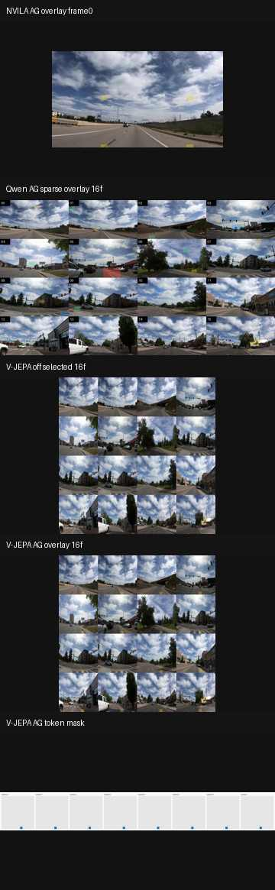
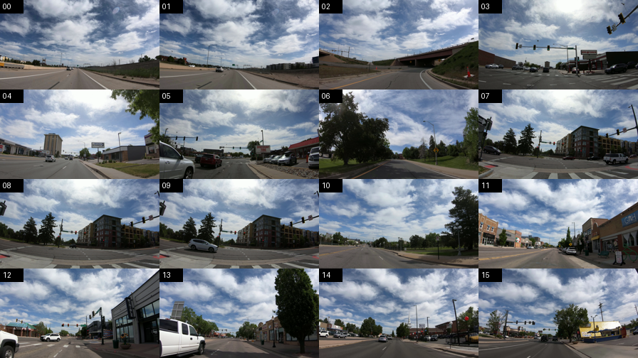
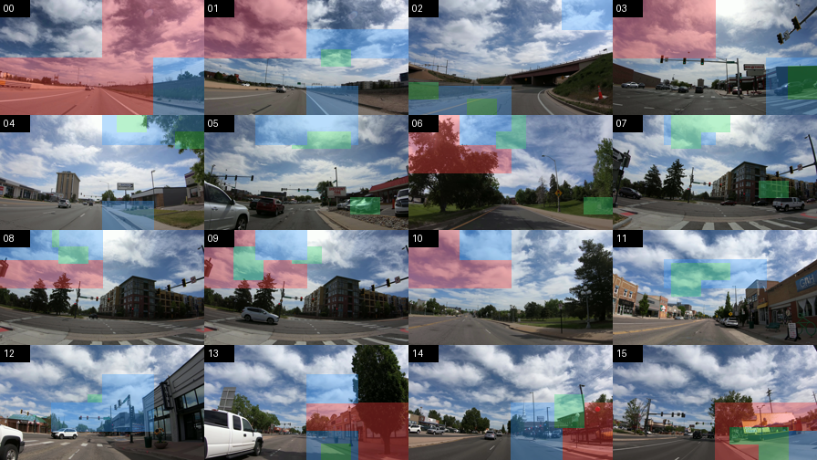

# Colab/Kaggle CUDA 검증 리포트 V2

작성일: 2026-05-28  
대상 브랜치: `codex/autogaze-repro`  
기준 커밋: `bc293ce Add Colab verification V2 report` 기반 Kaggle CUDA 재검증

## 결론

V2 기준으로 확인해야 하는 축은 세 가지입니다.

| 축 | single inference | HLVid mini benchmark | AutoGaze on/off 비교 | 16프레임 시각화 |
|---|---|---|---|---|
| NVILA-HD native | CUDA smoke 확인됨 | CUDA smoke 확인됨 | `keep-all-single` vs `autogaze` | Kaggle artifact 생성 확인 |
| Qwen plugin | single 3모드 CUDA 확인됨 | CUDA smoke 확인됨 | `qwen_full_vit`, `qwen_chunked_vit`, `qwen_chunked_vit_autogaze_sparse` | sparse plan 기반 16프레임 overlay 생성 |
| V-JEPA2 + Qwen | CUDA smoke 확인됨 | CUDA HLVid mini 확인됨 | `dense_off` vs `autogaze_single_grid` | 16프레임 selected/overlay/mask 생성 확인 |

현재 조사 결론은 이렇습니다.

- NVILA-HD native 경로는 가장 안정적입니다. AutoGaze가 processor 내부에서 실제로 적용되고, SigLIP/Vision encoder/LLM latency와 token/memory 지표가 함께 기록됩니다.
- Qwen plugin sparse 경로는 generate까지 동작합니다. 단, 출력 품질이 아직 안정적이라고 보기는 어렵고 HLVid mini에서도 정답을 맞추지 못했으므로, 현재 주장은 “pre-ViT sparse/token 감소 경로가 실제 실행됐다”까지만 해야 합니다.
- V-JEPA2 + Qwen은 “동작 smoke / zero-shot bridge”로는 확인됐지만, Qwen에 맞춰 학습된 projector가 아니므로 accuracy 성능 주장은 아직 하면 안 됩니다. token/latency/memory plumbing 검증 용도로만 해석해야 합니다.
- 16프레임 시각화는 V2부터 기본값을 `16`으로 올렸고, Kaggle CUDA 실행에서 NVILA/Qwen/V-JEPA artifact 생성을 확인했습니다. 아래에는 원격 artifact를 축소해 만든 요약 이미지와 로컬 fallback asset을 함께 둡니다.

## 정확성 해석

| 경로 | 실행 정확성 | 성능/정답 주장 가능 여부 | 이유 |
|---|---|---|---|
| NVILA-HD + AutoGaze | 높음 | HLVid full run 이후 가능 | official NVILA-HD processor 내부 AutoGaze/SigLIP/MLLM 경로를 사용 |
| Qwen + AutoGaze sparse | 중간 | 아직 제한 | AutoGaze index를 Qwen grid/rotary position에 매핑해 sparse ViT/generate는 실행되지만, 논문 학습 조합이 아니고 mini run 정답률은 아직 0 |
| V-JEPA2 + Qwen | 낮음, PoC | 금지 | V-JEPA feature를 Qwen embedding 차원에 deterministic repeat/truncate로 연결한 zero-shot bridge이며 학습된 projector가 없음 |

따라서 Qwen/V-JEPA 결과가 “정확하게 답을 맞추는 모델”처럼 보이지 않는 것은 맞습니다. 다만 이것은 runner가 죽거나 selector가 무시된 실패라기보다, 아직 semantic alignment가 없는 PoC 경로라는 의미입니다.

## 16프레임 시각화

아래 첫 이미지는 Kaggle CUDA 실행 산출물을 축소해 만든 요약 이미지입니다. NVILA는 overlay MP4의 첫 프레임 preview, Qwen/V-JEPA는 실제 16프레임 PNG artifact를 사용했습니다.



원격 artifact 예시:

```text
/kaggle/working/autogaze_v2_outputs/nvila_single_smoke/visualizations/single_clip_av_video_5_001_autogaze_processor_autogaze_overlay.mp4
/kaggle/working/autogaze_v2_outputs/qwen_single_visualizations/qwen_autogaze_sparse_overlay_16f.png
/kaggle/working/autogaze_v2_outputs/visualizations/vjepa_qwen_on_autogaze_overlay.png
/kaggle/working/autogaze_v2_outputs/visualizations/vjepa_qwen_on_vjepa_token_mask.png
```

아래 이미지는 로컬 `inputs/hlvid_example/clip_av_video_5_001.mp4`에서 16프레임을 uniform sampling해 만든 문서용 fallback 확인 asset입니다. CUDA artifact와 구분하기 위해 `docs/assets/colab_v2/` 아래에 저장했습니다.

### 선택 프레임 16장



### AutoGaze sparse overlay 예시

이 overlay는 로컬 Qwen sparse smoke plan인 `outputs/autogaze_repro/qwen_modes_smoke/qwen_chunked_vit_autogaze_sparse_actual_cpu_224_g002_autogaze_sparse_plan.json`을 사용했습니다.



생성 manifest:

```text
docs/assets/colab_v2/manifest.json
```

주의: 로컬 fallback 이미지는 “시각화 코드가 16프레임과 sparse patch overlay를 제대로 그리는지” 확인하는 asset입니다. CUDA 실제 artifact 기준 해석은 위 Kaggle 요약 이미지와 원격 artifact 경로를 우선합니다.

## CUDA 실행 증거 요약

### NVILA-HD single

실행 조건:

```text
model: nvidia/NVILA-8B-HD-Video
AutoGaze checkpoint: /kaggle/working/autogaze_weights/nvidia__AutoGaze
device: cuda, device_map: auto, dtype: float16
video: inputs/hlvid_example/clip_av_video_5_001.mp4
frames: 16
max_tiles_video: 1
video_resize_longest_edge: 224
decode_strategy: seek
```

| mode | answer | total ms | preprocess(no AG) ms | AutoGaze ms | vision encoder ms | generate ms | LLM forward ms | encoder selected/raw | LLM visual tokens | peak memory |
|---|---|---:|---:|---:|---:|---:|---:|---:|---:|---:|
| `keep-all-single` | `The` | 21149.79 | 11425.44 | 0.69 | 5331.11 | 9723.66 | 3944.30 | 25088 / 25088 | 2816 | 12.48 GiB |
| `autogaze` | `The` | 11269.76 | 5348.55 | 1516.32 | 1939.79 | 4404.90 | 2209.53 | 17024 / 33920 | 1904 | 7.85 GiB |

해석:

- AutoGaze는 selector cost를 추가하지만, 이 smoke에서는 vision encoder latency와 peak memory가 감소했습니다.
- 이 수치는 `224`, `1 tile`, `16 frames` smoke이므로 논문 HLVid 성능값을 대체하지 않습니다.
- V2 재실행에서 `overlay_frame_count=16`, processor input preview `224x126`, 원본 selected frame preview `3840x2160` artifact가 생성됐습니다.

### NVILA-HD HLVid mini benchmark

| mode | failed | parse_failed | accuracy_total | generated | total ms | AutoGaze ms | vision encoder ms | generate ms | LLM forward ms |
|---|---:|---:|---:|---|---:|---:|---:|---:|---:|
| `single-scale dense` | 0 | 0 | 0.0 | `A` | 14348.84 | 0.84 | 4825.15 | 9146.74 | 3861.17 |
| `autogaze` | 0 | 0 | 0.0 | `A` | 10914.60 | 1256.77 | 1762.68 | 4149.63 | 2137.80 |

정답은 `B`였고 두 모드 모두 `A`를 출력했습니다. 따라서 이 mini run은 정확도 주장이 아니라 benchmark wrapper가 prediction/summary/gain report를 생성하는지 확인한 smoke입니다.

## Qwen plugin 검증

### Qwen single inference

V2 notebook의 세 single mode 모두 Kaggle CUDA에서 실행됐습니다.

| mode | selector | ViT path | answer | total ms | input build ms | Qwen ViT prepare ms | generate ms | visual tokens after/before | context tokens | peak memory |
|---|---|---|---|---:|---:|---:|---:|---:|---:|---:|
| `qwen_full_vit` | off/keep-all | native full Qwen ViT | `The` | 14184.03 | 4521.35 | n/a | 2432.78 | n/a | 285 | 3.47 GiB |
| `qwen_chunked_vit` | off/keep-all | chunked Qwen ViT | `A` | 12455.29 | 4101.64 | 738.31 | 438.45 | 256 / 256 | 285 | 8.40 GiB |
| `qwen_chunked_vit_autogaze_sparse` | AutoGaze on | sparse chunked Qwen ViT | `The` | 11433.45 | 4309.19 | 100.35 | 189.71 | 16 / 256 | 45 | 4.28 GiB |

V2 single 명령은 `repro.flexible_runner --mode single`을 직접 사용합니다. Qwen2.5 weight를 `qwen3-vl` adapter override로 사용한 smoke 조합은 이전 Kaggle 검증과 동일합니다.

### Qwen HLVid mini benchmark

Kaggle T4 x2에서 `scripts/run_hlvid_folder_benchmark.py --plugin-suite qwen`으로 확인한 값입니다.

| mode | implementation | generation | answer | total ms | input build ms | Qwen ViT prepare ms | generate ms | visual tokens after/before | context tokens |
|---|---|---|---|---:|---:|---:|---:|---:|---:|
| `qwen_full_vit` | `executed` | `executed` | `A` | 12897.17 | 4502.15 | n/a | 1180.23 | n/a | 325 |
| `qwen_chunked_vit` | `executed` | `executed` | `A` | 11050.25 | 4167.38 | 245.38 | 165.07 | 256 / 256 | 325 |
| `qwen_chunked_vit_autogaze_sparse` | `executed` | `executed` | `A` | 10884.60 | 4321.95 | 151.72 | 97.44 | 140 / 256 | 209 |

조사 결과:

- 처음 실패한 `56+112+224`는 patch size `16`으로 나누어 떨어지지 않았습니다.
- `64+128+224`는 3-scale이라 AutoGaze checkpoint의 4-scale decoder와 맞지 않았습니다.
- `64+128+192+224`, patch size `16`, tile size `224`에서 sparse mode가 실행됐습니다.
- wrapper는 이제 sparse mode가 포함될 때 scale을 명시하지 않아도 resize에 맞춰 4-scale 기본값을 채웁니다.

## V-JEPA2 + Qwen 검증

### Single smoke

Kaggle actual smoke 결과:

| case | status | answer | total ms | V-JEPA selected/raw | AutoGaze selected/raw | Qwen visual tokens | peak memory |
|---|---|---|---:|---:|---:|---:|---:|
| `vjepa_qwen_dense_off` | `passed` | `Describe the video in one short sentence. The video is about` | 22396.73 | 1568 / 1568 | n/a | 1568 | 7.51 GiB |
| `autogaze_vjepa_qwen_on` | `passed` | `Describe the video in one short sentence.` | 23871.06 | 8 / 1568 | 16 / 4240 | 8 | 7.12 GiB |

해석:

- V-JEPA token은 `1568 -> 8`, Qwen visual token도 `1568 -> 8`로 감소했습니다.
- Qwen generate latency와 V-JEPA sparse encode latency는 줄었습니다.
- AutoGaze selector cost가 약 `9799 ms` 추가되어 end-to-end 속도 최적화는 별도 개선 과제입니다.
- zero-shot bridge는 projector 학습 없이 `inputs_embeds`로 연결하는 구조라서 답변 품질을 성능 주장으로 쓰면 안 됩니다.
- 현재 V-JEPA sparse 정책은 `patch_embedding_scope=dense_all_vjepa_tokens`, `encoder_scope=selected_vjepa_tokens_only`입니다. 즉 3D conv/patch embedding은 전체 crop/tubelet에 적용하고, transformer encoder 입력부터 AutoGaze가 선택한 V-JEPA token index만 사용합니다.

### HLVid mini benchmark

V2 notebook의 `repro.vjepa_qwen_hlvid_benchmark` mini run도 Kaggle CUDA에서 실행됐습니다.

```text
RUN_VJEPA_QWEN_HLVID_MINI = True
--vjepa-qwen-modes dense_off,autogaze_single_grid
--visualization-max-frames 16
```

| mode | status | answer suffix | total ms | V-JEPA selected/raw | AutoGaze selected/raw | Qwen visual tokens | visualization |
|---|---|---|---:|---:|---:|---:|---|
| `dense_off` | `passed` | `D` | 14692.97 | 1568 / 1568 | n/a | 1568 | 16 frames, overlay skipped |
| `autogaze_single_grid` | `passed` | `D` | 19279.96 | 8 / 1568 | 16 / 4240 | 8 | 16 frames, overlay written |

정답은 `B`였고 두 모드 모두 최종 답변 suffix가 `D`였습니다. 이 run도 성능 주장이 아니라 V-JEPA sparse bridge와 HLVid wrapper artifact 생성을 확인하는 smoke입니다.

생성 artifact:

```text
/kaggle/working/autogaze_v2_outputs/vjepa_qwen_hlvid_mini/vjepa_qwen_hlvid_summary.json
/kaggle/working/autogaze_v2_outputs/vjepa_qwen_hlvid_mini/runs/dense_off/00000.json
/kaggle/working/autogaze_v2_outputs/vjepa_qwen_hlvid_mini/runs/autogaze_single_grid/00000.json
/kaggle/working/autogaze_v2_outputs/vjepa_qwen_hlvid_mini/runs/*/visualizations/*.png
```

## V2에서 반영한 코드 변경

| 항목 | 변경 |
|---|---|
| V-JEPA2+Qwen visualization | `repro.vjepa_qwen_runner --visualization-max-frames` 기본값 `4 -> 16` |
| Colab smoke wrapper | `scripts/run_colab_autogaze_cuda_smoke.py` 기본 visualization frame 수 `16` |
| NVILA notebook | single smoke에 `--visualization-output-dir`, `--visualization-fps` 추가 |
| Qwen notebook | `repro.flexible_runner` single 3모드 추가 |
| V-JEPA benchmark notebook | `repro.vjepa_qwen_hlvid_benchmark` mini benchmark 셀 추가 |
| V2 report normalizer | NVILA nested summary, Qwen generation metrics, sparse plan artifact path를 공통 report로 normalize |
| 로컬 문서 asset | `scripts/build_colab_v2_visualization_assets.py`로 16프레임 selected/overlay PNG 생성 |

## 다음 CUDA 재실행에서 추가되는 세부 profiling

이 커밋 이후 Qwen/V-JEPA 경로도 NVILA처럼 stage를 더 잘게 기록합니다. 기존 Kaggle 수치는 이 필드 추가 전 실행값이므로, 같은 notebook을 다시 돌리면 아래 항목이 JSON/Markdown report에 추가됩니다.

| 경로 | 새 latency field | 의미 |
|---|---|---|
| Qwen input | `qwen_prompt_template`, `video_decode_read`, `qwen_processor_call`, `qwen_process_vision_info` | prompt template, runner-side decode/resize, Qwen processor 호출 분리 |
| Qwen ViT | `qwen_vit_chunk_slice`, `qwen_vit_patch_embed`, `qwen_vit_position_embedding`, `qwen_vit_token_gather`, `qwen_vit_transformer_blocks`, `qwen_vit_merger` | chunk/sparse Qwen visual path의 patch embed, position, block, merger 분리 |
| V-JEPA | `vjepa_pixel_tensorize`, `vjepa_patch_embedding`, `vjepa_encoder_total`, `vjepa_encoder_encoder_layers_total` | V-JEPA dense patch embedding과 sparse encoder 구간 분리 |
| V-JEPA bridge | `qwen_bridge_project_vjepa_to_qwen_dim`, `qwen_bridge_build_qwen_inputs_embeds` | V-JEPA feature를 Qwen inputs_embeds로 붙이는 zero-shot bridge 비용 |
| AutoGaze selector | `autogaze_selector_*` | direct AutoGaze selector 내부 decode/tile/tensorize/forward 세부 시간 |

## 재실행 체크리스트

Kaggle 또는 Colab CUDA 런타임에서 [notebooks/autogaze_external_cuda_verification.ipynb](../notebooks/autogaze_external_cuda_verification.ipynb)를 위에서부터 실행합니다.

필수 확인:

- `RUN_NVILA_SINGLE = True`
- `RUN_QWEN_SINGLE = True`
- `RUN_NVILA_HLVID_MINI = True`
- `RUN_QWEN_PLUGIN_HLVID_MINI = True`
- `RUN_VJEPA_QWEN_HLVID_MINI = True`

성공 조건:

- NVILA single: `keep_all_single.json`, `autogaze.json`, `nvila_single_visualizations/*` 생성
- Qwen single: `qwen_single_smoke/qwen_full_vit.json`, `qwen_chunked_vit.json`, `qwen_chunked_vit_autogaze_sparse.json` 생성
- V-JEPA2+Qwen single: `vjepa_qwen_dense_off_cuda_smoke.json`, `autogaze_vjepa_qwen_on_cuda_smoke.json`, `visualizations/*16프레임*` 생성
- NVILA HLVid mini: `hlvid_autogaze_gain_report.json` 생성
- Qwen HLVid mini: `plugin_hlvid_summary.json`와 `runs/qwen_*/*.json` 생성
- V-JEPA2+Qwen HLVid mini: `vjepa_qwen_hlvid_summary.json` 생성

## 남은 검증 리스크

| 리스크 | 상태 | 이유 |
|---|---|---|
| full HLVid accuracy 재현 | 미완료 | 현재는 limit 1 smoke 중심 |
| V-JEPA2+Qwen accuracy 주장 | 금지 | zero-shot bridge라 semantic alignment 없음 |
| NVILA/Qwen/V-JEPA 동일 조건 속도 비교 | 부분 가능 | single smoke 조건은 맞췄지만 모델 구조가 달라 해석 범위 제한 필요 |
| 원격 visualization artifact 로컬 복사 | 부분 완료 | 축소 요약 이미지는 로컬 asset으로 복사했고, 원본 MP4/PNG는 Kaggle 경로를 기록 |

따라서 V2의 정확한 결론은 “NVILA-HD native, Qwen plugin, V-JEPA2+Qwen 세 파이프라인의 single/benchmark 실행 경로와 token/latency/memory/visualization 계측 경로가 Kaggle CUDA에서 확인됐다”입니다. 다만 full HLVid accuracy 재현과 V-JEPA2+Qwen의 의미 있는 semantic 성능 평가는 별도 과제로 남습니다.
