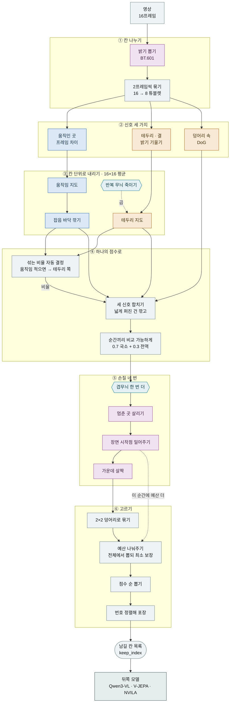

# Borissal v0.6 — 어떻게 패치를 고르는가

영상이 들어와서 "이 칸만 뒤로 보내라"가 나올 때까지 v0.6이 실제로 하는 일. 모든 값은
`BorissalConfig.v0_6(scale=384)` 실측이고, 단계 순서는 `modeling_borissal.py`의 실행 순서와
같다 — **이 라인에서 순서는 스펙의 일부다**(§4).

시각화 버전(단계별 시뮬레이터 포함)은 `v06-pipeline.html`에 있다. 실제 클립을 v0.6에 통과시켜
단계마다의 중간 결과를 그대로 임베드한 페이지이며, 이미지가 base64로 들어가 용량이 크므로
**추적하지 않는다**(`.gitignore`). 생성 방법은 §7.

```
학습된 가중치 0개 · 동결 사전학습 모델 0개 · 고전 신호만
16프레임 384px → 10.8 ms (Mac CPU) · 격자 (8, 24, 24) = 4,608칸
예산 25%면 1,152칸만 남긴다 · jit.trace + ONNX-17 통과 · 데이터 의존 분기 없음
```

## 1. 전체 흐름



색: 파랑 = 움직임/시간, 오커 = 테두리/모양, 자주 = v0.6 신규, 청록 = 곱해서 깎는 문.
점선 = 곱셈·예산 경로.

## 2. 단계별 상세

쉬운 말이 먼저, 코드 용어는 뒤에.

| # | 하는 일 | 코드 용어 | 내용 |
|---|---|---|---|
| 00 | 칸 나누기 | `grid_thw` | 정사각으로 맞춘 뒤 16px 칸으로 자르고 2프레임씩 접는다. 나누어떨어지지 않으면 거부 — 해상도 고정된 뒤쪽 타워가 막히는 지점이 이 검사다. `(16,3,384,384) → (8,24,24)` = 4,608칸 |
| 01 | 밝기 뽑기 **v0.6** | `luma_mode="bt601"` | v0.5까지 RGB 단순 평균 → `0.299R+0.587G+0.114B`. **모든 신호가 이 밝기에서 나오므로 가장 뿌리에 있는 변경** |
| 02 | 움직인 곳 찾기 | `motion_diff="frame"` | 튜블렛 평균을 빼면 묶음 내부의 빠른 움직임이 상쇄되므로, 프레임끼리 뺀 뒤 묶음별 평균. **`stride=1`** — 프레임 수 보정(v0.4)은 v0.6에 없다(§6) |
| 03 | 테두리 · 결 찾기 | `spatial_op="grad"` | 밝기가 급변하는 곳. `√(dx²+dy²)`, 튜블렛 평균 위에서 |
| 04 | 칸 단위로 내리기 | `avg pool 16` | 두 지도를 칸 격자로. 이후 전부 칸 해상도에서 — v0.5가 속도를 45% 줄인 핵심 |
| 05 | 반복 무늬 죽이기 | `coherence gate` | 벽돌·격자·긴 직선처럼 한 방향으로만 결이 뚜렷한 곳을 누르고, 여러 방향이 섞인 물체 안쪽은 살린다. 배경 무늬가 예산을 먹는 걸 막는 장치. 곱셈 |
| 06 | 잡음 바닥 깎기 | `noise floor q=0.5` | 진짜 움직임은 드문드문하므로 그 순간 전체의 중간값은 정지 칸이 정한다 → 그 값을 잡음으로 보고 뺀다. 코덱 dead-zone과 같은 발상 |
| 07 | 섞는 비율 자동 결정 | `motion_weight="auto"` | `w = E[움직임]/(E[움직임]+E[테두리])`. 32f 실측 0.34, 정지 클립 0.03 → **움직임이 적을수록 물체·글자 쪽으로 기운다** |
| 08 | 세 신호 합치기 | `fusion_norm="peak"` + `dog_blob_weight=0.5` | 화면 전체에 고르게 퍼진 지도는 **가중치가 깎인다**(뾰족한 지도 우대) → 지도 수준 무늬 억제 + 카메라 흔들림 자동 무시. 여기서 **덩어리 속**(DoG) 신호가 합류해 테두리가 비워둔 물체 내부를 채운다 |
| 09 | 순간끼리 비교 가능하게 | `score_norm_blend=0.7` | 각 순간을 따로 정규화하면 모든 순간이 똑같이 중요해진다. 클립 전체 기준 성분을 섞어 순간 간 크기 차를 남긴다 — **전역 예산 배분이 의미를 갖기 위한 전제** |
| 10 | 겹무늬 한 번 더 깎기 **v0.6** | `laplacian_gate` | 움직임 대비 잔무늬가 촘촘한 곳을 곱셈으로 누른다(05와 목적 겹치나 다른 잣대). ⚠️ 로컬 지표에서 **악화**(0.299 vs v0.5 0.343) — 켜둔 것은 외부 다운스트림 증거를 로컬 지표보다 신뢰한 의도적 선택 |
| 11 | 멈춘 곳 살려주기 **v0.6** | `static_guard` | **국면 전환**이 핵심. 07의 비율은 클립 전역 값 하나인데, 이건 그 순간이 멈춰 있을 때만 국소적으로 테두리 힘을 되돌린다. 움직임 큰 순간은 영향 0. 글자·문서·고정 샷이 살아남는 이유. **v0.6 네 손질 중 로컬 지표에서 유일하게 이긴 것**(+0.012) |
| 12 | 장면 시작점 밀어주기 **v0.6** | `keyframe_prior gop=8` | 배포 시 코덱 정보가 없으므로 기준 프레임 구조를 픽셀·번호만으로 흉내낸다: 8프레임 주기 가짜 기준점(순수 번호 계산) + 밝기 급변의 부드러운 장면전환 가중치(분기 없이 시그모이드). 효과 두 갈래 — 점수 상승 **그리고 칸 추가 배정** |
| 13 | 가운데 살짝 우대 **v0.6** | `center_bias=0.3` | 완만한 가우시안 가점. ⚠️ 로컬 지표 악화(−0.030) — 이 데이터셋 피사체가 가운데 없는 경우가 많아서. 도메인 불일치이지 원리의 반박은 아니다 |
| 14 | 2×2 덩어리로 묶기 | `score_coarsen=2` | §3 규칙 1 |
| 15 | 예산 나눠주고 뽑기 | `per_frame_allocation="global"` | §3 규칙 2 |
| 16 | 뒤쪽 모델에 넘기기 | `Selection` → adapters | `to_qwen3vl_video_tokens` · `to_vjepa2` · `to_autogaze_gazing_info` · `to_videomae_gazing_info` · `to_onevision_frame_indices` |

## 3. 칸을 고르는 규칙 — 실제 숫자로

점수 지도가 만들어진 다음이 진짜 선택이다. 아래는 `videos/internvid_eval16/gSH74lYC7lI_t10.8-15.6_fps13.2.mp4`,
16프레임 384px, 예산 25%에서 나온 **실제 값**이다.

```
격자   8 순간 × 24 × 24 = 4,608칸        (한 순간당 576칸)
예산   비율 0.25 → 총 1,152칸            (균등하면 순간당 144칸)
바닥   순간마다 최소 36칸 보장 → 먼저 288칸 확정
경쟁   남은 864칸을 클립 전체에서 점수순으로
상한   한 순간이 내놓을 후보는 288칸까지 (균등 몫의 2배)
결과   순간별 [64, 76, 184, 160, 188, 168, 152, 160] · 합계 1,152칸
```

### 규칙 1 — 낱칸이 아니라 2×2 덩어리로 고른다

점수를 12×12로 평균 낸 뒤 다시 24×24로 펼친다. 그러면 2×2 네 칸이 **똑같은 점수**를 갖게 되어,
점수순으로 뽑을 때 네 칸이 항상 함께 뽑히거나 함께 버려진다. 흩어진 낱칸 대신 물체 덩어리가
남는다. 토큰 격자는 24×24 그대로여서 뒤쪽 모델과의 약속은 바뀌지 않는다.

이게 뒤쪽 붙이기에서 결정적이다: Qwen3-VL·Qwen3.5는 2×2를 하나의 토큰으로 합치므로
**우리 선택 단위가 그쪽 토큰 단위와 정확히 일치**한다 — 리맵 없이 1:1로 붙는다
(`downstream-stacks.md`).

### 규칙 2 — 예산은 전체에서 뽑고, 순간마다 최소는 보장

순간마다 똑같이 나눠주면 아무 일도 없는 순간에 칸을 낭비한다. 그래서 클립 전체에서 점수순으로
뽑되, 각 순간이 최소 `m`칸은 반드시 갖도록 바닥을 깐다. 순서:

1. **바닥 확보** — 순간마다 점수 상위 `m`칸(위 예시 36칸)을 무조건 확정.
2. **남은 예산 경쟁** — 남은 `K_total − T·m`칸(864칸)을 확정분 제외 전체에서 한 번에 뽑는다.
3. **독점 방지** — 한 순간이 노출할 후보를 균등 몫의 2배(288칸)로 제한. 안 하면 문이 거의 다 열려
   덩어리 효과가 사라진다(경험적 발견).
4. **포장** — 남긴 칸을 **번호 오름차순**으로 정렬해 넘긴다. 뒤쪽이 각 토큰을 원래
   `(순간, 행, 열)`로 되돌리는 근거이므로 이 순서는 불변이다. 키가 유일하도록 구성해
   stable sort 없이 plain argsort를 쓴다(ONNX 제약).

```
K_total = min(max(T_grid, round(ratio·L)), L)
m       = min(max(1, round(0.25 · K_total / T_grid)), K_total // T_grid)
k_gate  = min(N_pf, 2 · ceil(K_total / T_grid))
```

### 규칙 3 — 무엇이 예산을 끌어오는가

점수를 올리는 손질은 두 방식으로 예산에 작용한다. **전역** 방식에서는 점수가 높아지면 그 순간이
자동으로 더 많은 칸을 가져간다 — 위 결과가 균등 몫 144칸에서 64~188칸으로 벌어진 이유다.
**균등** 방식에서는 점수만 올려도 칸 수가 고정이라 아무 일도 없으므로, 장면 기준 프레임 우대는
할당 단계에서 직접 칸을 옮기는 별도 경로를 갖고 있다.

> **예산은 정확히 맞는다.** `64+76+184+160+188+168+152+160 = 1,152 = 총예산`.
> 예전에 이게 조용히 깨진 적이 있다: 상한을 *반올림 뒤에* 걸어서 초과분이 재분배 없이
> 버려졌다(25%에선 안 보이고 75% 이상에서만 드러남). 지금은 상한을 *반올림 전에* 적용하고
> 남는 양을 여유 있는 순간으로 흘려보낸다 — `design.md` "Budget-exactness fix" 참조.

## 4. 순서 규칙 — 바꾸면 조용히 망가진다

- **잡음 바닥 깎기**는 정규화보다 **앞**. 뒤로 가면 조용한 순간에서 잡음이 최대까지 재증폭된다.
- **섞는 비율**은 정규화보다 **앞**. 정규화된 지도는 절대 크기를 지우므로 에너지 비가 무의미해진다.
- **합치기**는 잡음 바닥 **뒤**. 잡음 스파이크 하나가 "뾰족한 지도 우대"를 이기지 못하게.
- **손질 네 번**은 2×2 묶기보다 **앞**. 12×12 평균이 손질 끝난 점수를 받아야 한다.
- **정규화**는 시간 평활보다 **앞**(v0.6에선 평활 꺼짐). 날 크기 지도를 평활하지 않는다.
- **움직임 주변 대비**는 잡음 바닥보다 **앞**(v0.6에선 꺼짐). center-surround 먼저, dead-zone 다음.

## 5. 계보

```
v0.6 = v0.5 + { luma_mode="bt601", laplacian_gate, static_guard, keyframe_prior, center_bias=0.3 }
             + per_frame_allocation: "uniform" → "global"
v0.5 = v0.3 + { score_coarsen=2, motion_weight="auto", coherence_at_grid, spatial_diff="tubelet" }
v0.3 = 채택된 후보 조합 { fusion_norm="peak", coherence_gate(ds=4), dog_blob_weight=0.5 }
```

**주의**: v0.5는 v0.4가 아니라 **v0.3** 위에 있다 → v0.6의 `motion_diff_stride = 1`.
"v0.6이 최신이니 다 들어있다"가 자연스러운 오해다.

## 6. v0.6에서 꺼둔 것

지운 게 아니라 판정 결과다.

| 기능 | 값 | 왜 |
|---|---|---|
| 프레임 수 맞춰 간격 보정 (v0.4) | `stride=1` | v0.5가 v0.3 위에 세워졌다. v0.4는 시간을 이해하는 인코더 뒤에서 기각됐는데 그 이유가 "움직임이 중복"이었으므로 **프레임별 인코더에서는 재평가 대상**(`downstream-stacks.md` 가설 1) |
| 움직임 주변 대비 | `motion_center_surround` off | 단독 심사 미채택 |
| 주파수 서명 · 색 희소성 | 가중치 0 | 조합 심사 탈락 → 실험용 노브로 유지 |
| 시간 평활 · 선택 관성 | off | 안정성 장치. "품질 비열화일 때만 채택" 규칙에 걸림 |
| 고르게 퍼뜨리기 | `spread_fraction=0` | 단일 클립에선 좋았으나 실데이터에서 중립 → 배포 노브로만 |
| 블록 게이트 | `block_size=1` | 2×2 묶기가 같은 일을 더 강하게 하므로 중복 |

## 7. 비용 · 약속 · 시각화 재생성

| 항목 | 값 | 비고 |
|---|---|---|
| 속도 (Mac CPU, 16f) | 10.8 ms | v0.3의 19.9 ms에서 45% 단축 |
| 속도 (32f) | 23.0 ms | v0.3 40.3 ms 대비 43% 단축. 목표 ≤ 25 ms |
| 예산 정확성 | 정확 | 모든 비율에서 순간별 합 = 총예산. 100%면 전부 유지 |
| 인덱스 약속 | 오름차순 · 중복 없음 | 뒤쪽이 `(순간, 행, 열)`을 되돌리는 근거 |
| 모바일 내보내기 | jit.trace + ONNX-17 | 데이터 의존 분기 없음 |
| 학습 가중치 | 없음 | 고전 신호만. 동결 사전학습 모델도 쓰지 않는다 |

시각화 페이지(`v06-pipeline.html`, 미추적)의 단계별 지도는 `select_with_intermediates`와
v0.6 손질 노브를 **누적으로 켜가며** 실제로 계산한 것이다 — JS 재구현이 아니므로 실제 코드와
어긋날 수 없다. 필요하면 같은 방식으로 다시 만들면 된다: v0.5 상태에서 시작해
`laplacian_gate → static_guard → keyframe_prior → center_bias` 순으로 하나씩 켜고 각 단계의
`_saliency_scores(...)["score"]`를 저장, 마지막에 `score_coarsen` 큐브와 `keep_mask`를 얹는다.

⚠️ 로컬 지표(SigLIP2 recall)상 v0.6 전체 켜기는 v0.5보다 낮다(0.2925 vs 0.3425). 현재 기본값은
외부 다운스트림 증거를 로컬 지표보다 신뢰한 의도적 베팅이며 아직 독립 검증 전이다 —
`downstream-stacks.md`의 D1/D2 실험이 그 검증이다.
